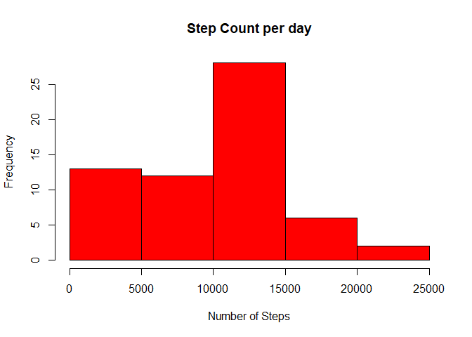
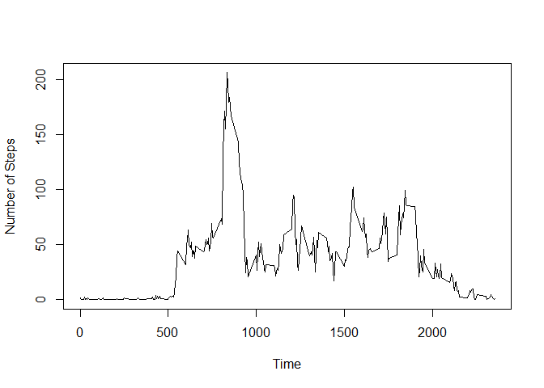
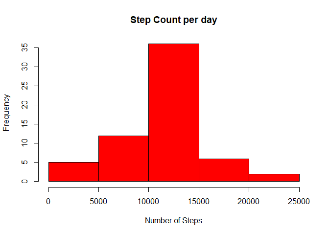
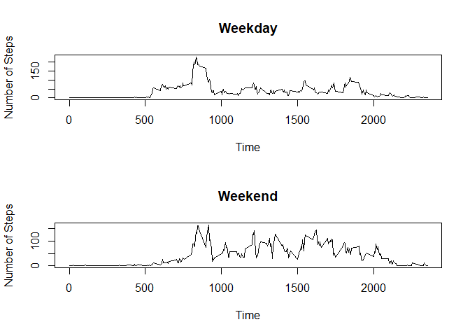

## R Markdown


#load libraries needed for code to work 

```r
library(dplyr)
library(readr)
library(tidyverse)       
library(xlsx)
library(data.table)
library(knitr)
library(lubridate)
```

Loading and preprocessing the data

```r
unzip("activity.zip")
activityDF <- read.csv("activity.csv")
activityDF$DateTime <- paste(activityDF$date, activityDF$interval)
activityDF$DateTime <- as.POSIXct(activityDF$DateTime)
activitySum <- activityDF %>%            
  group_by(DateTime) %>%                     
  summarise(DailySteps = sum(steps,na.rm=TRUE))    

#Histogram of the total number of steps taken each day
hist(activitySum$DailySteps, col="red",xlab = "Number of Steps", main = "Step Count per day")
```

<!-- -->


What is mean total number of steps taken per day?

```r
#Mean
mean(activitySum$DailySteps,na.rm = TRUE) 
```

```
## [1] 9354.23
```

```r
#Median
median(activitySum$DailySteps,na.rm = TRUE) 
```

```
## [1] 10395
```

What is the average daily activity pattern?

```r
activityInt <- activityDF %>%            
  group_by(interval) %>%                     
  summarise(AverageSteps = mean(steps,na.rm = TRUE))        

#Time series plot of the average number of steps taken
plot(activityInt$interval,activityInt$AverageSteps,type = "l", ylab = "Number of Steps", xlab = "Time")
```

<!-- -->

```r
#The 5-minute interval that, on average, contains the maximum number of steps
activityInt[which.max(activityInt$AverageSteps),]
```

```
## # A tibble: 1 x 2
##   interval AverageSteps
##      <int>        <dbl>
## 1      835         206.
```


Imputing missing values

```r
#Total number of missing values in the dataset 
 sum(is.na(activityDF))
```

```
## [1] 2304
```

```r
   NewDF <- left_join(activityDF,activityInt, by = "interval") %>% # this will generate age.x and age.y
     mutate(steps = ifelse(is.na(steps), AverageSteps, steps)) %>% # we generate a joint 'age' variable
     select(-AverageSteps) 
   NewDFSum <- NewDF %>%            
     group_by(DateTime) %>%                     
     summarise(DailySteps = sum(steps))   
#New dataset with the missing data filled in.
   newSet <- NewDF[,1:3]
#Histogram of the total number of steps taken each day after missing values are imputed
   hist(NewDFSum$DailySteps, col="red",xlab = "Number of Steps", main = "Step Count per day")
```

<!-- -->

Mean and median number of steps taken each day after missing values are imputed

```r
   mean(NewDFSum$DailySteps) 
```

```
## [1] 10766.19
```

```r
   median(NewDFSum$DailySteps) 
```

```
## [1] 10766.19
```

Are there differences in activity patterns between weekdays and weekends?

```r
    fullDF <- NewDF[,1:3]

      #convert date and interval to DateTime 
      fullDF$DateTime <- paste(fullDF$date, fullDF$interval)
      fullDF$DateTime <- as.POSIXct(activityDF$DateTime)
      fullDF$DayOfWeek <- weekdays(fullDF$DateTime)
      fullDF$WeekdayOrWeekend <- ifelse(str_detect(fullDF$DayOfWeek,c("Monday|Tuesday|Wednesday|Thursday|Friday")),
                                        fullDF$WeekdayOrWeekend <- "weekday", fullDF$WeekdayOrWeekend <- "weekend")
    
     fullInt <- fullDF %>%            
         group_by(interval) %>%                     
         summarise(AverageSteps = mean(steps,na.rm = TRUE))   
    
     weekdayDF <- fullDF[grepl("weekday",fullDF$WeekdayOrWeekend),] 
     weekendDF <-fullDF[grepl("weekend",fullDF$WeekdayOrWeekend),] 
      weekdayInt <-  weekdayDF %>%            
         group_by(interval) %>%                     
         summarise(AverageSteps = mean(steps))   
      
      weekendInt <-  weekendDF %>%            
         group_by(interval) %>%                     
         summarise(AverageSteps = mean(steps))   
      #Panel plot comparing the average number of steps taken per 5-minute interval across weekdays and weekends
      par(mfrow = c(2,1))
      plot(weekdayInt$interval,weekdayInt$AverageSteps,type = "l", ylab = "Number of Steps", xlab = "Time", main = "Weekday")
      plot(weekendInt$interval,weekendInt$AverageSteps,type = "l", ylab = "Number of Steps", xlab = "Time", main = "Weekend")
```

<!-- -->


